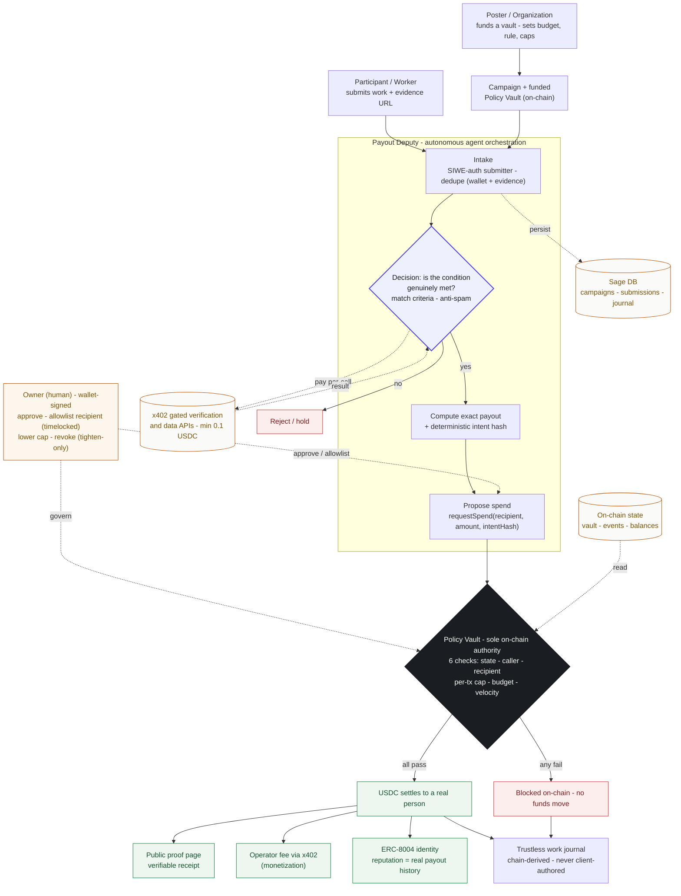

# Sage — Agentic Workflow

The Payout Deputy: how a real payment flows from work submitted to USDC settled,
with the Policy Vault as the sole on-chain authority. Covers inputs, agent
orchestration, human-in-the-loop steps, data sources & APIs, key decision points,
and outputs.

## Legend (the six required elements)

- **Inputs** — the Poster funds a vault and sets the rule; the Participant submits work + evidence.
- **Agent orchestration** — the Payout Deputy: intake + dedupe → condition match → compute payout → propose spend.
- **Data sources & APIs** — x402 gated verification/data endpoints (paid per call), on-chain state reads, the Sage DB.
- **Human-in-the-loop** — the owner only, wallet-signed: approve/allowlist a recipient, lower a cap, revoke. Tighten-only, never loosen.
- **Key decision points** — (1) is the condition genuinely met? (2) the Policy Vault's six on-chain checks.
- **Outputs** — USDC settles (or is blocked on-chain), a public proof receipt, the operator fee via x402, ERC-8004 reputation, and a trustless chain-derived work journal.
