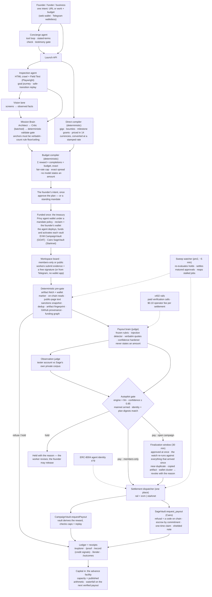

# Sage — Technical documentation (Future Caribbean submission)

Repository: https://github.com/shariqazeem/sage · License: MIT · Live: https://sagepays.xyz
Setup: `npm install && npm run dev` (see README → "Commands"); every integration degrades honestly
when its secret is absent, so the app runs with no keys and says what is pending.

## Architecture — the agentic workflow

Three model "brains" and a browser agent do the reasoning; a deterministic compiler, a deterministic
gate and an on-chain vault decide anything that touches money. The AI proposes, the vault disposes.

**Agents and their boundaries.** The Concierge (Telegram and web) turns a founder's sentence into
tool calls and never does money math. The Inspection agent browses the product in a real browser,
fills safe forms, replays safe transitions, and records only what it saw. The Mission Brain
(architect and critic, two calls with a deterministic validate gate between them and after them)
designs paid missions from that record. The Payout brain judges evidence and proposes pay, review or
hold — it is forbidden from stating an amount, its rubric and injection detector are frozen code,
and a confidence hardener can only lower confidence. The Observation judge scores a tester's account
against Sage's own private observations so a copied mission card can never pass. Every money
decision is made by deterministic code: the budget compiler, the pre-gate, the autopilot gate, and
finally the vault, which derives the amount itself and can refuse.

**Human moments.** Two by design — state the intent, fund it — and both can be done once: a
treasury under a mandate lets the agent deploy, fund and activate every subsequent plan itself.
Nothing else needs a person. On an open campaign the agent approves at once and settles after a
finalization window it uses to watch the wallet graph; a hold carries its reason and the worker's
revise path; a kill switch, campaign stop and withdraw exist and are tested; real-money autonomy
must be explicitly armed. Sage earns on what it settles (a per-settlement fee over x402) and on
financing (the advance facility), never on seats.

**Multi-provider lanes.** Each job (mission design, payout judgment, observation judging, vision,
concierge) runs on its own provider by configuration, with a fallback provider after a measured
failure; token budgets are declared as answer sizes and each provider's reasoning overhead is added
by a profile. Compute is spent where it changes an outcome: the browser loop makes zero model calls,
deterministic checks run before any model, and refusals cost nothing.

### The autonomous operator

A founder funds once; the agent runs the programme. `src/lib/operator/policy.ts` is a pure module holding every ceiling — weekly, per campaign, a reserve floor, concurrency, and a cap on capital sitting unclaimed on the board — and it sizes each commitment from those ceilings and from observed results, so a surface whose work gets claimed earns a larger allocation and one that goes quiet earns none and is stopped. `decide.ts` is the only part a model touches and it selects a position, never a price; the surface set is closed to what the founder declared, and a proposal naming money is discarded. `tick.ts` runs inside the existing sweep as a stateless gate. Every commitment is written to `operator_launches` with its reason before any money moves, and is vetoable for a window, so the audit trail precedes the spend rather than describing it afterwards.

For the credit thesis this matters twice: the deposit behaves as a bounded working-capital account, and both sides accumulate verified payment history — the business's outflow record and the worker's inflow record — which is exactly the thin-file data the lender endpoint already serves.

### The ledger, drawn

The organization's console renders the agent's work as objects rather than messages, each bound to a record: the **vault** (locked capital cut into mission allocations to the base unit, paid slots drained, released coins linked to receipts), the **settling lane** (agent-approved payouts counting their finalization window down, with the sweep's own three checks as lights — `watchReadings()` feeds both the display and the verdict), and the public **wallet graph** at `/graph/<campaign>` (payout, gas-funding and consolidation edges from chain reads and recorded links; a linked cluster is one person's wallets and is held). Nothing is animated that did not happen — the rule that the feed never fabricates progress, applied to the visual layer.

### One person, one slot

A wallet is free; a person is not. On public work (listed, no allowlist) claiming a slot requires a one-time World ID proof of personhood (`IDENTITY_DOOR`): the provider returns a nullifier unique to the person and the action, Sage stores that nullifier against the wallet and nothing else, and every cap — mission slots, the per-campaign payout cap — counts `personWallets()`: the wallets sharing the nullifier, the wallets the consolidation watch linked on chain, and the wallets the person declared as theirs. Members-only work is untouched; the organisation chose its people. A second wallet presenting a nullifier already seen is linked and flagged, so verifying twice is not free (`src/lib/identity/`, `src/lib/campaigns/visibility.ts`).

## Data sources

- **The product itself** — fetched HTML, rendered pages, screenshots, console errors (the Field Test).
- **On-chain state** — GOAT Network and Starknet mainnet via RPC: vault state, settlement events, transaction receipts; the ledger is derived from settlement events, never typed in.
- **Submitted evidence** — public URLs, created artifacts, transaction hashes; fetched by Sage, confined inside untrusted-data markers.
- **OFAC SDN list** — vendored, dated snapshot; screened at every EVM door (the list carries no Starknet addresses).
- **World Bank WDI `SI.RMT.COST.IB.ZS`** — inbound remittance cost per receiving country (Jamaica 3.59%, Haiti 4.70%, Dominican Republic 2.52%, Guyana 7.92%, 2023), vendored and dated; the corridor each Caribbean obligation is measured against.
- **Exchange rates** — a stamped, source-attributed quote per obligation currency at composition time.
- **GitHub public API** — repository provenance (fork flag, creation date) for artifact gigs, degrading to no signal when rate-limited.

## Models

- **MiniMax-M3** — mission design (architect, critic) and the payout judge; promotion-gated on the live batteries (P-JUDGE zero wrong auto-pays across 57 rows; P-WORK 14 attacks zero leaks, 12 honest zero false holds).
- **Claude Haiku 4.5** (via an OpenAI-compatible gateway) — the concierge, and the fallback provider for mission design.
- **Gemini 3.1 Flash-Lite** — the vision lane and the grounded (observation-cited) architect.
- The observation judge and every gate are deterministic code; no model computes an amount.

## Third-party tools and infrastructure

Next.js 15 (App Router, Turbopack) · TypeScript strict · SQLite via better-sqlite3 + Drizzle · Playwright (Field Test, video pipeline) · viem (EVM) · starknet.js (Starknet) · Solidity `CampaignVault` (GOAT, Metis Sepolia testnet) · Cairo `SageVault` + `SageClaims` (Starknet mainnet, privacy class `0x6d5577…5aa0`) · Privy server wallets under a mandate policy (walletless founders) · x402 (paid verification, operator fee) · ERC-8004 agent identity · Telegram Bot API · pm2 on a 2-vCPU VM · Vitest (4,300+ tests incl. a red-team suite) · MIT license.

## Live evaluation batteries (the quality gate)

P-GEN (13 product categories, anchor integrity must be 100%), P-DIRECT (founder briefs → compiled
gigs and grants), P-WORK (gig judging: attacks and honest work), P-JUDGE (payout judge promotion),
P-ROUTE (tool routing across both surfaces), P-VERIFY (verification contracts), and a Starknet
dry-run that must refuse a control row. Every battery imports production's own prompts and tools.
